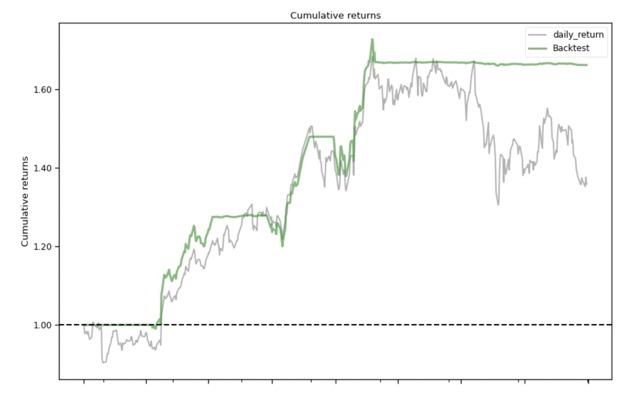
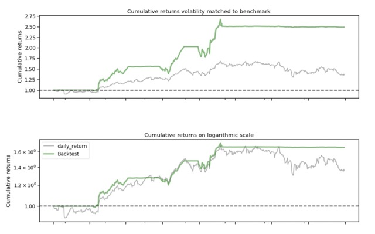
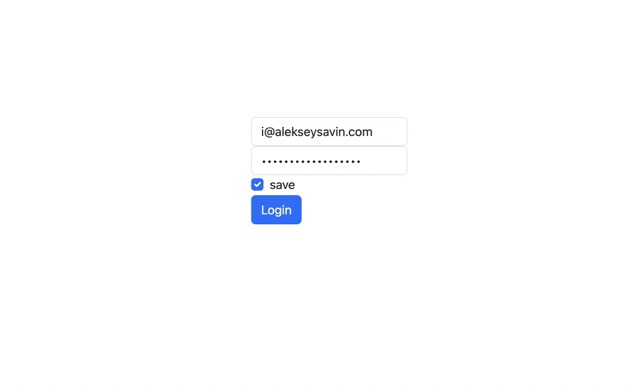
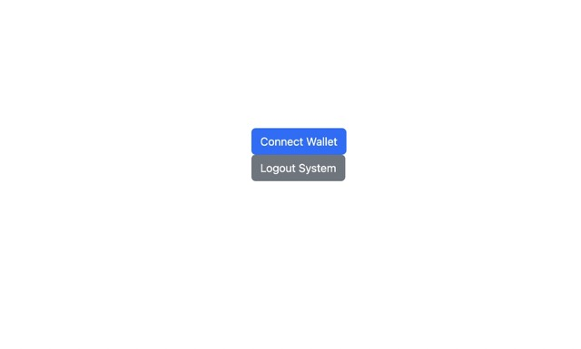
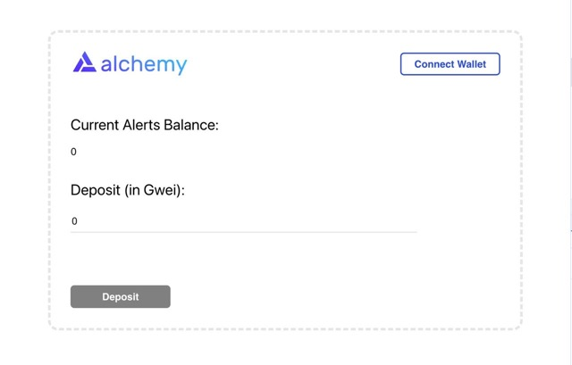
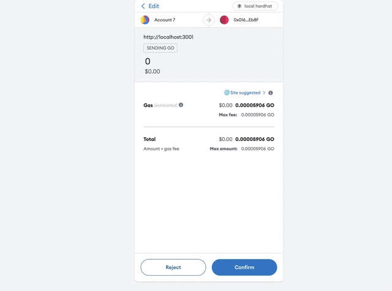
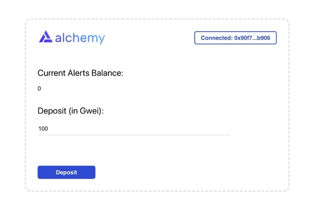
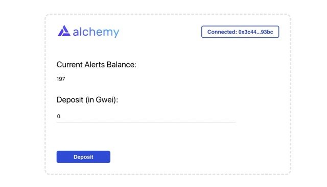

# Multiuser Trade News: Sentiment analysis (MTNSA)
## Fullstack Web3 Application.
### MTNSA: serves as a helpful tool for traders and investors. It empowers users to make informed decisions by analyzing market sentiments derived from news. 📲 💹 💸

#### Teledev: Aleksey Savin, Alexander Belov
BOC Fintech Hackathon 4.0, Bank of Cyprus, 2023

---
## About us 🔎
### Our team:
| 👨‍💻 | 👨‍💻 | What we do: 👇| 
| ---- | ---- | ------------ | 
|  |  | Now, the Teledev team consists of Alexandr and Aleksey. We've been working together on the 'Multiuser Trade News Sentiment Analysis' project for a while now, and our collaboration is off to a great start.
---
# Problem 🤷
#### 1. Market Gap 🕺: Our platform addresses the challenge of accurately predicting future price movements despite the use of various analytical methods and tools. Market volatility, external factors, and unexpected events can complicate the forecasting process significantly.
#### 2. Customers 🦹‍♀️: We provide data-driven insights to serve both experienced traders and novice investors, helping them navigate the complexities of price prediction in a volatile market.
#### 3. Costs 🧙‍♂️: We prioritize competitive pricing to address the financial challenges traders may face while accessing high-value services.
#### 4. Usability 👨‍💼: Ensuring usability for traders at all levels is a significant challenge in providing easy access to our tools.
---
# Solution 💆‍♂️
#### 1. Closing the Gap 🏪: We offer a complete cycle from signal acquisition to trade execution, ensuring comprehensive market coverage and timely decision-making.
#### 2. Target Audience 💅: Our primary audience consists of traders, catering to their diverse needs and strategies in the financial markets.
#### 3. Cost Saving ☕️: We excel in analyzing large volumes of data and conducting contextual and methodological document-based queries, leading to substantial cost savings.
#### 4. Easy to Use 📲: Our platform's user-friendly interface allows you to effortlessly connect your wallet and gain access to signals. We've implemented blockchain-based signal tracking to guarantee transparency and accountability, delivering a seamless trading experience.
---
## Innovate 🚀
1. **Real-time Insights** ⏳: Multiuser sentiment analysis offers real-time market sentiment data, aiding traders and investors in quick decision-making amidst fast-paced markets.
2. **Data Aggregation** 📈: It consolidates vast data from diverse sources like social media, news, and market data, providing a holistic understanding of market sentiment.
3. **Machine Learning** 👨‍🏫: Utilizing advanced machine learning, it processes sentiment data with increasing precision and predictive capabilities.
4. **Risk Management** ⚠️: Sentiment analysis helps identify market risks and trends, enabling proactive risk mitigation and refined trading strategies in blockchain, crypto, and fintech markets.
---
# The Progress during hackathon
## 🤖 Agents - small programs - are our helpers, here are the results: 

| 💹 | 💹 |
| ---- | ----
|  | 
### Ai4Finance benchmarks: [FinGPT Demos](https://github.com/AI4Finance-Foundation/FinGPT#fingpt-demos)
---
## Benchmarks 1
### GPT Models 🗣️
FinGPT v3.2 leads in FiQA-SA performance and efficiency, with Llama2 close but costly, while BloombergGPT lags in both, requiring model choice based on needs and budget.
| Weight | BloombergGPT | Llama2              | FinGPT v3.2  |
| ------ | ---- | ------------------------ | --- |
| `FiQA-SA` | 0.751	 | 0.800	          | 0.860   |
| `Time` | 53 days	  | 21 days	     | 2 hours   |
| `Cost` | $2.67 million	  | $4.23 million	 | $65.6   |
| `Devices` | 512 × A100	  | 2048 × A100	    | 8 × A100   |
---
## Benchmarks 2: 
### RL Models 👾
Choose based on priorities: SharpeDQN offers safer returns, ProfitDQN yields higher maximum returns for risk-tolerant investors.
| Trading System | Avg. Return (%) | Max Return (%) | Min Return (%) | Std. Dev. |
|----------------|-----------------|----------------|----------------|-----------|
| ProfitDQN      | -0.29           | 49.80          | -30.24         | 5.04      |
| SharpeDQN      | 1.63            | 31.18          | -11.29         | 3.76      |
| SharpeDDQN     | 0.59            | 38.66          | -7.26          | 3.01      |
| ProfitD-DDQN   | -0.38           | 40.07          | -27.18         | 4.55      |

---
## Mock up 1: React Web App
| 📸 | 👨‍💻 | | 
| ---- | ---- | ------------ | 
|  |  | 
Screens 1, 2
---
### Mock up 2: React Web App
| 📲 | ✅ | | 
| ---- | ---- | ------------ | 
|  |  | 
Screens 3, 4
---
### Mock up 4: React Web App
| 📲 | ✅ | | 
| ---- | ---- | ------------ | 
|  |  | 
Screens 5, 6
---

## Roadmap ⛳️

1. Idea: 2021.01 💡
2. Develop alfa version: 2023.07 🥇
3. Develop beta version: 2023.10 🏝️
4. Release?  🎯

 It's exciting to see how an idea in January 2021 (Two thousand twenty-one) will transform into a tangible product by the end of the year. The question mark at the end leaves us curious and eager for the big release in the future! 🚀🌟

---
## Special promotion
### For Bank of Cyprus 🇨🇾: Enjoy a 75% discount on signals. Get in early! 🤑❤️. Connect your account for trading now! 🚀
## Our Support Service 🫶 for B2B
At our service, you'll find 24/7 online support, staffed by a team of friendly designers and consultants who are dedicated to ensuring your satisfaction. Plus, we stand by our commitment with a money-back guarantee. Your peace of mind is our top priority! 😊🌟

---

## Key Takeaways 🎼

1. 🇩🇪 Cloud Database in Frankfurt 
2. 📄 React SPA 
3. 💱 Monetisation and returns
4. 🎯 Target Achievement
5. 🕸️ Incorporates a Web3 smart contract for seamless fintech operations 
6. 🧶 Many integrations

---
## Thank you! 🙂
Thank you so much for your attention! I'm thrilled to be of assistance. Feel free to reach out to me through the following contacts:

1) Savin A.: You can visit my website at https://alekseysavin.com 👈
2) Badaev A.: Check out their website at https://baadev.com 👈

Don't hesitate to get in touch if you have any questions or need further information. I look forward to connecting with you! 📸